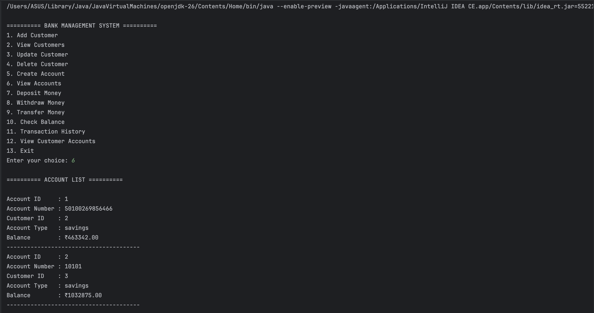
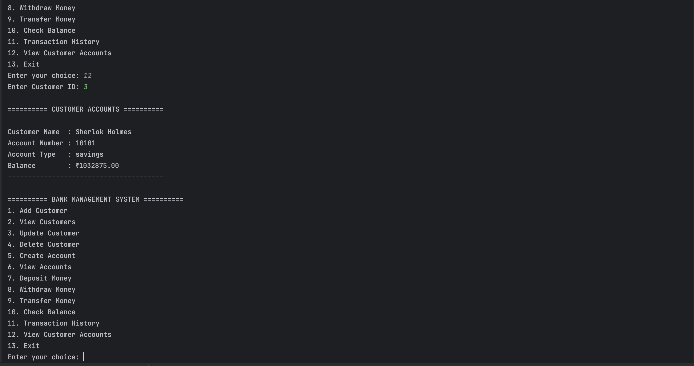
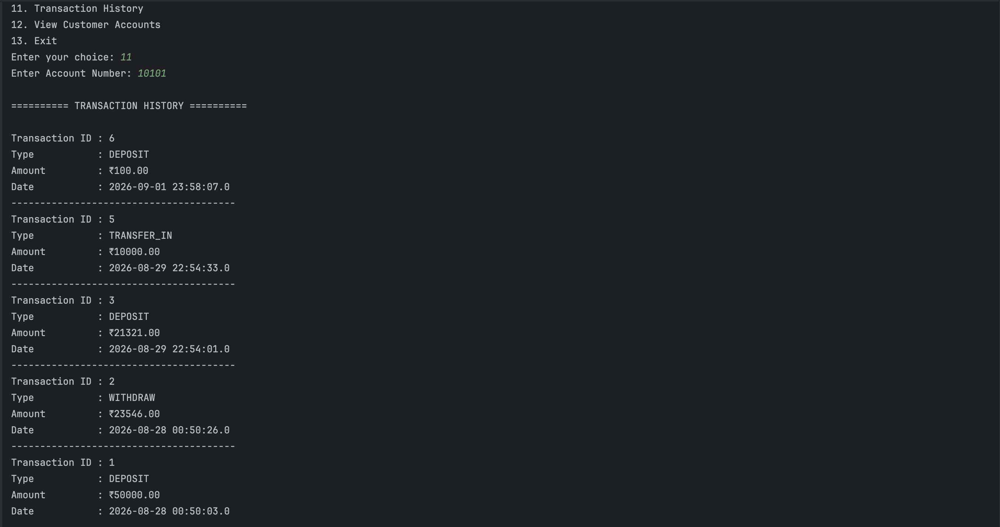

# Bank Management System

A console-based Bank Management System developed using Java, MySQL, and JDBC.

This project demonstrates how a Java application can interact with a relational database using JDBC and perform real banking operations with transaction management.

## Features

- Add customer
- View customers
- Update customer details
- Delete customer
- Create bank account
- View all accounts
- Deposit money
- Withdraw money
- Transfer money between accounts
- Check account balance
- View transaction history
- View all accounts belonging to a customer
- Input validation
- Database transaction management using commit and rollback

## Technologies Used

- Java
- JDBC
- MySQL
- IntelliJ IDEA
- Git
- GitHub

## Project Structure

```text
src/
└── com.bank/
    ├── Main.java
    │
    ├── dao/
    │   ├── CustomerDAO.java
    │   ├── AccountDAO.java
    │   └── TransactionDAO.java
    │
    ├── model/
    │   ├── Customer.java
    │   ├── Account.java
    │   └── Transaction.java
    │
    ├── util/
    │   ├── DBConnection.java
    │   └── InputValidator.java
    │
    └── exception/
        └── BankException.java

database/
└── bankdb.sql

screenshots/
├── viewAccounts.png
├── viewCustomerAccounts.png
└── Transaction.png
```

## Database Design

The system uses three main tables:

### Customers

Stores customer information such as:

- Customer ID
- Name
- Email
- Phone
- Address

### Accounts

Stores bank account information such as:

- Account ID
- Account Number
- Customer ID
- Account Type
- Balance

Each account is associated with a customer using a foreign key.

### Transactions

Stores:

- Transaction ID
- Account Number
- Transaction Type
- Amount
- Transaction Date

## JDBC Architecture

The application follows a simple DAO-based architecture:

```text
User
 ↓
Main.java
 ↓
DAO Classes
 ↓
JDBC
 ↓
MySQL Database
```

The DAO classes are responsible for database operations, while model classes represent the application's data.

## Transaction Management

Financial operations such as deposits, withdrawals, and transfers use database transactions.

For example, a transfer performs multiple database operations:

```text
Withdraw from sender
        ↓
Deposit into receiver
        ↓
Record TRANSFER_OUT
        ↓
Record TRANSFER_IN
        ↓
Commit
```

If an operation fails, the transaction is rolled back to prevent a partially completed transfer.

## Database Setup

1. Install MySQL.
2. Create the database using the provided SQL script:

```text
database/bankdb.sql
```

3. Configure the database credentials in the application's environment variables.
4. Run `Main.java`.

## Important

The database password is not stored in the source code.

The application reads the password from the environment variable:

```text
DB_PASSWORD
```

Set this variable before running the application.

## Example Operations

The application provides a menu-driven interface:

```text
========== BANK MANAGEMENT SYSTEM ==========

1. Add Customer
2. View Customers
3. Update Customer
4. Delete Customer
5. Create Account
6. View Accounts
7. Deposit Money
8. Withdraw Money
9. Transfer Money
10. Check Balance
11. Transaction History
12. View Customer Accounts
13. Exit
```

## Screenshots

### Account List



### Customer Accounts



### Transaction History



## Future Improvements

Possible future improvements include:

- REST API using Spring Boot
- Authentication and authorization
- Web-based user interface
- JPA/Hibernate integration
- Automated testing
- Docker deployment

## Author

Yatharth Pal